# Surtr ⚔️🔥

**Reliable Windows Automation — Image & OCR Powered**

Surtr – Reliable Windows Automation When Other Tools Fail

[](https://github.com/Evic7/surtr/stargazers)
[](https://github.com/Evic7/surtr/releases)
[](https://github.com/Evic7/surtr/releases)

Many automation tools rely on fixed coordinates or fragile selectors. Scripts break when windows move, apps update, or screens change resolution.

Surtr is a free, open-source, lightweight tool that automates almost anything on Windows — especially when other tools break due to UI changes, window moves, app updates, or different resolutions.

Instead of fragile coordinates or brittle selectors, Surtr **looks at your screen like a human** — using **image detection** and **OCR (text recognition)** to find and interact with buttons, text, icons, and forms reliably.

  
*(Image-based automation survives window moves and resolution changes)*

## Why Choose Surtr?

- Works when coordinate-based macros fail  
- Built-in macro recorder turns actions into instant scripts  
- Powerful web downloader (often faster than IDM)  
- Advanced OCR for reading receipts, invoices, screenshots  
- **SurtrUI** desktop IDE + **WebUI** remote access — both completely free  
- Task Bot scheduler for unattended recurring jobs  
- No subscriptions, no ads, fully offline by default  

## Quick Start (2 minutes)

1. Download the latest release: [https://github.com/Evic7/surtr/releases/latest](https://github.com/Evic7/surtr/releases/latest)
2. Run the installer (adds to PATH automatically)
3. Open CMD and test:
surtr --version
text4. Launch the desktop IDE:  
Double-click surtrUI on the desktop or `surtrui.exe` in surtr installation folder (or run `surtrui`)
5. Launch WebUI (remote/browser control):  
Run `webuilauncher` → open http://127.0.0.1:4444  
Default login: admin / admin (change immediately!)

You now have:
- Local SurtrUI (IDE + Task Bot)
- Remote WebUI (browser access to desktop, scripts, files)

Full docs: [surtr.cu.ma/docs.php](http://screenbot.cu.ma/docs.php) or run `define` in Surtr.

## How Surtr Works: The Basics

Surtr runs as a lightweight CLI tool, but shines through its **visual intelligence**:
- **Image Detection** (`seeImage`, `moveToWord`, `textOnScreen`)  
Searches screen for images or text → returns coordinates or true/false
- **OCR Engine** (`imageReader`, `readScreen`)  
Extracts text from live screen or images
- **Scripting (.as files)**  
Variables `{{var}}`, conditions `if ?run`, loops, labels, multi-line `^^ … ^^`
- **SurtrUI** — native IDE with visual builder, terminal, Task Bot
- **WebUI** — browser-based remote control (live desktop stream, file browser, terminal, script builder)

Everything runs locally — no cloud dependency.

## Power Feature #1 — Fetcher: Faster Downloads & Scraping

Fetcher is Surtr's built-in web tool — often **faster than IDM** thanks to parallel segmented downloads, retries, and backoff.

### Single Fast Download (beats IDM on big files)
<div align="center">
  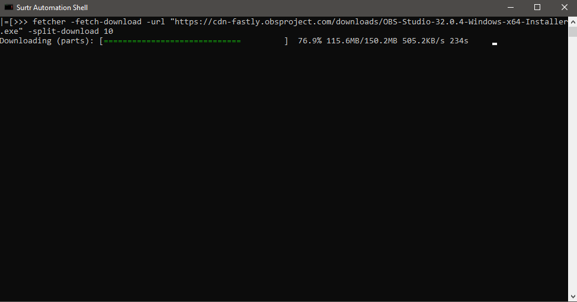
</div>
```
fetcher -fetch-download ^
-url https://example.com/linux.iso ^
-saveto linux.iso ^
-split-download 8 ^           # 8 parallel chunks
-chunk-size 4096 ^            # 4 MB per chunk
-retries 10 ^                 # retry up to 10 times
-backoff-factor 1.5 ^         # increasing delay on retry
-show-progress                # live progress bar
```
Multiple / Batch Downloads
Create downloads.json:
```
[
  {"url": "https://site.com/file1.zip", "save_as": "dl1.zip", "split_download": 6},
  {"url": "https://site.com/video.mp4", "save_as": "movie.mp4", "split_download": 12}
]
```
Run:
`fetcher -fetch-download-json downloads.json -max-worker 10`
→ Downloads 10 files concurrently, each split → finishes batch much faster.

Web Scraping with Fetcher

Fetch → parse → extract:
```fetcher -fetch '[{"url":"https://news.com/article","parser":"bs4","select":"div"}]'```

BS4 vs SBS4 parser — which to use?

BS4 (BeautifulSoup): full HTML parsing — accepts local file path even raw html text in the url field. Best for complex selectors, classes, nesting
Example: -select "div.article > p:first-child"
SBS4 (STRICT): only accepts http,https in the url field
Example: -select "p" → all paragraphs as plain text

Scrape Local HTML Files

```fetcher -fetch '[{"url":"C:\path\myfile.html","parser":"bs4","select":"div"}]'```

Power Feature #2 — imageReader (Advanced OCR)
Extract text from images, screenshots, receipts, invoices.

Basic:
`imageReader -image receipt.png -lang eng`

Best practices:

Clean low-contrast scans `imageReader -image scan.jpg -transform bw -min-conf 65 -psm 6`
Preserve columns/layout `imageReader -image invoice.png -char-width 9 -line-height 22 -save invoice.txt`
Silent + save `imageReader -image screenshot.png -hide-output -save result.txt`
Live screen OCR `screenShot temp.png ++ imageReader -image temp.png -lang eng`

Power Feature #3 — SurtrUI (Desktop IDE)
Launch: surtrui or double-click surtrUi

Three tabs:

Script Builder — visual editor, syntax highlighting, command buttons, run/save instantly
Terminal — type Surtr commands live, see output immediately
Surtr Task Bot — schedule anything (every 5 min, daily, weekly), monitor next run

SurtrUI screenshot — Script Builder + Task Bot

## Surtr in Action

<div align="center">
  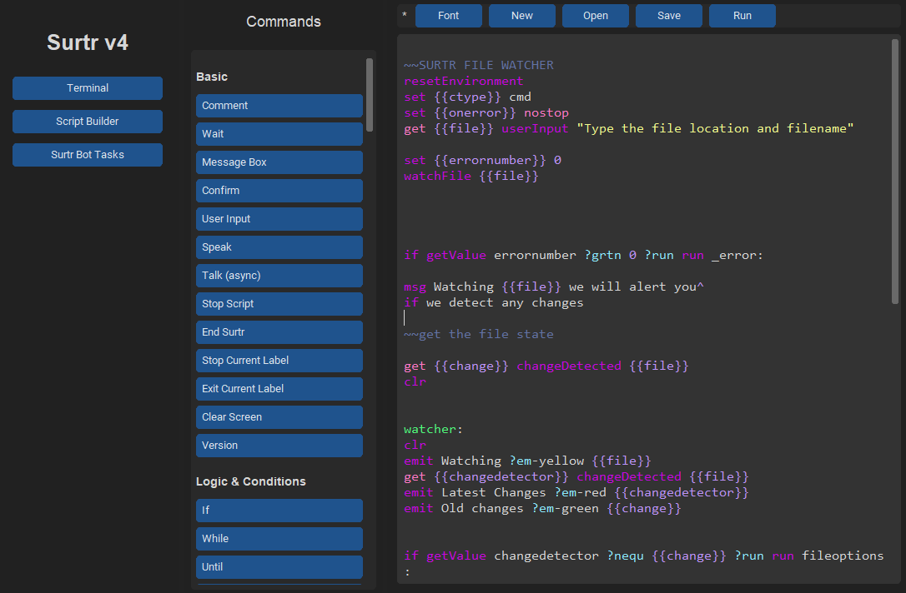
  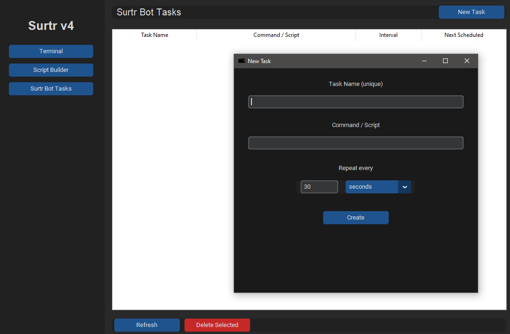
  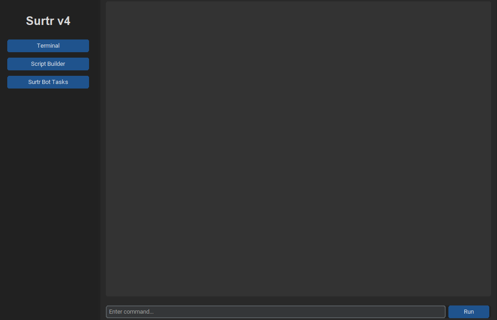
</div>


Power Feature #4 — WebUI (Remote Browser Control)

Launch: webuilauncher → open http://127.0.0.1:4444

<div align="center">
  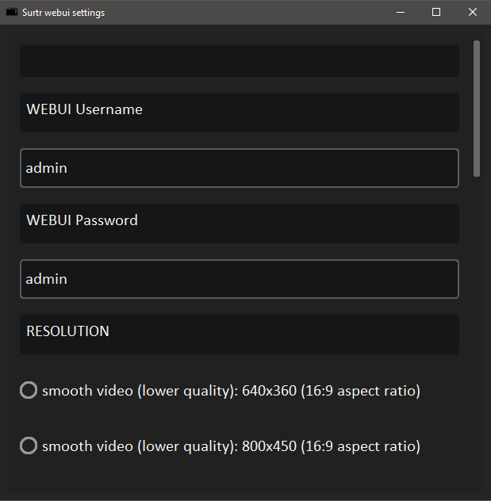
  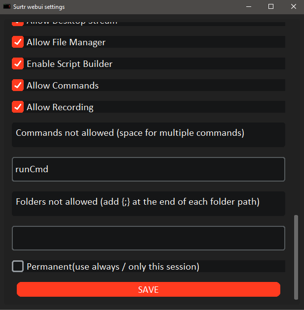
  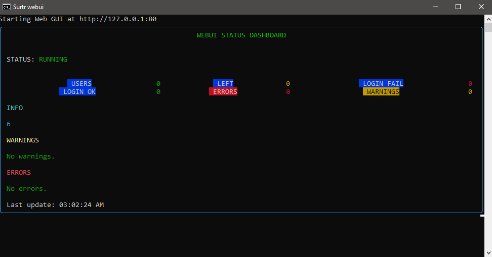
</div>

Default login: admin / admin (change immediately!)
What you get in browser:

Live Desktop Stream — watch Surtr automate in real time
File Browser — explore/download files remotely
Terminal — run commands from anywhere
Script Builder — build/run scripts visually in browser

WebUI live desktop stream example

<div align="center">
  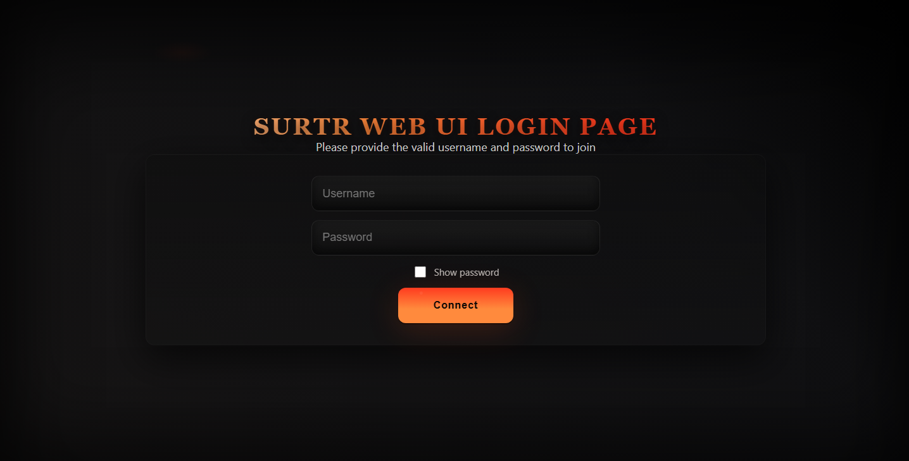
  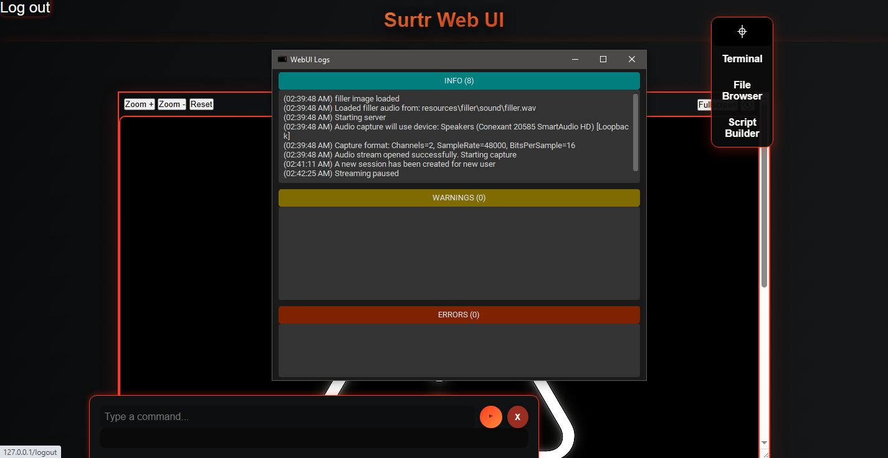
  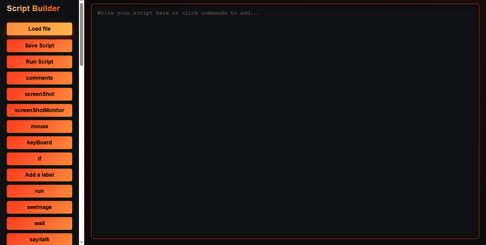
</div>


## Surtr Macro Recorder — Turn Actions into Scripts Instantly

One of Surtr’s most powerful features is the built-in **Macro Recorder** — it watches what you do with your mouse and keyboard, then automatically generates a perfect Surtr script (.as file) that replays those exact actions reliably.

### How to Use It (30 seconds)

1. Open SurtrUI (or run `surtrui` in CMD)
2. run command: `startRecorder mymacro.as` OR `startRecorder mymacro.as 60` recorder will stop after 60 seconds
   
3. Do your normal actions:
   - Click buttons
   - Type text
   - Move windows
   - Scroll pages
   - Anything!
4. run `stopRecorder`
 
5. Surtr instantly creates `mymacro.as` with mouse + keyboard actions saved to the script

Now run it anytime:

surtr run mymacro.as

### Real Example of Generated Script

Macro Recorder in action — recording & replaying reliably

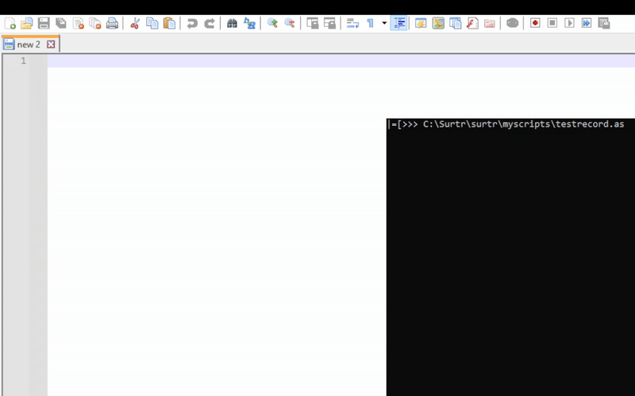  

Pro Tips for Best Results

Keep actions clear — avoid very fast clicks
Use consistent button appearance — save clean PNGs of buttons/icons if needed
Edit the script — open in SurtrUI → add conditions, loops, variables
Combine with Task Bot — record once → schedule forever (e.g. auto-save every hour)
Test after changes — resize windows or move apps → run script → verify it still works

The Macro Recorder turns hours of repetitive work into a one-click script.


Security notes:

Change default password via webuiconfig.exe
Use strong password + limit max users (webuilauncher ... maxuser:2)
Runs locally — no external server needed

Security & Best Practices

Enable guest mode: guestUser on → blocks dangerous commands
Password protect: setSecurityPassword strongpass → activateSecurity
Use set {{onerror}} mylabel: to handle failures gracefully
Validate inputs: if {{input}} ?cntn bad ?run stop
Test in SurtrUI terminal before scheduling
Keep Surtr updated — fixes improve security

Quick Examples

Auto-click save button 
```
while not seeImage save-btn.png ?run wait 2
mouse click
```
Read price from screenshot
```
screenShot price.png ++ imageReader -image price.png -lang eng -save price.txt
```
Schedule daily backup
In SurtrUI Task Bot:
Command: fileman copy C:\Data D:\Backup
Interval: every day at 23:00

## Surtr JSON – Easy & Powerful Data Handling

Surtr has built-in JSON commands that let you create, read, modify, append, save, delete, and query JSON data directly in scripts — no external tools needed.

JSON is stored in memory during your session (not persistent across runs unless saved to file).

### How Paths Work in Surtr JSON

- **Keys** (even simple ones) are always wrapped in square brackets: `[key]`
- **Numeric indices** (for lists/arrays) are left as plain numbers: `.0`, `.1`, etc.
- Paths start with the JSON name, then chain with dots: `name.[key].0.[subkey]`

This is the exact syntax Surtr expects — no exceptions.

### All JSON Commands (with real syntax)

| Command                        | Purpose                                      | Correct Example                                      |
|--------------------------------|----------------------------------------------|------------------------------------------------------|
| `json <name> <json>`           | Create or update named JSON                  | `json config {"theme":"dark"}`                       |
| `json <name>`                  | Print entire JSON                            | `json config`                                        |
| `json <name>.[key]`            | Get value at key                             | `json config.[theme]`                                |
| `json <name>.[key] <value>`    | Set value at key (creates if missing)        | `json config.[theme] light`                          |
| `jsonAppend <path> <value>`    | Append to list or dict at path               | `jsonAppend config.[favorites] "SurtrUI"`            |
| `jsonSave <name> <file> [indent]` | Save JSON to file (pretty with indent)    | `jsonSave config settings.json 2`                    |
| `jsonDelete <path>`            | Delete key or index at path                  | `jsonDelete config.[theme]`<br>`jsonDelete config.[list].0` |
| `lenJson <path>`               | Get length of array/string/object            | `lenJson config.[favorites]`                         |
| `jsonParse <json>`             | Parse raw JSON string (prints, no storage)   | `jsonParse {"key":"value"}`                          |

### Real Working Examples

1. **Create, read, set, and delete**

```
~~ Create JSON
json config '{"theme":"dark","favorites":["Task Bot"]}'

~~ Print whole thing
json config

~~ Get specific value
json config.[theme]   ~~ prints "dark"

~~ Change value
json config.[theme] light

~~ Add to array
jsonAppend config.[favorites] "SurtrUI"

~~ Delete key
jsonDelete config.[theme]

~~ Delete array index
jsonDelete config.[favorites].0

~~ Save to file
jsonSave config myconfig.json 2

```
Fetch API & parse
```
get {{data}}  fetcher -fetch '[{"url":"https://myapisite.com","parser":"json"}]'  -headers '{"User-Agent":"Mozilla/5.0","Accept":"application/json"}' -getdata


~~ Parse raw output
jsonParse {{data}}

~~ If you want to store it
json users {{data}}

~~ Access safely
json users.[0].[name]   ~~ prints first user's name
lenJson users           ~~ prints how many users

```
Safe check before use

```
json config {"active":true}

if json config.[active] ?run emit "Config is active!"

~~ Delete when done
jsonDelete config
```

Pro Tips

Always use [] for keys — even simple ones like [theme], [user-id]
Never wrap numbers — use .0, .1 for list indices
Multi-word values are fine: json config.[msg] hello world
Chain with fetcher: jsonParse {{data}} → then json mydata.[results].0.[title]
Clean up memory: jsonDelete <name> when finished with big data
Test in SurtrUI terminal — type commands live to see paths work

Surtr JSON turns complex data into simple automation — configs, API results, lists, everything.

## Surtr Configuration File – Customize Behavior Easily

Surtr comes with a powerful configuration file that lets you control how the tool behaves without editing scripts or command-line flags every time.

The file is located at:  
`C:\Surtr\surtr\surtrconfig.conf`  
(or in your install folder if you chose a custom path)

You can open it with any text editor (Notepad, VS Code, etc.) and change values as needed.  
Surtr reads this file on every startup.

### All Available Settings (2025)

```
# Allow labels in external scripts (useful for modular automation)
allowExternalScriptLabels=yes

# Automatically back up watched files for easy restoration when needed 
autoBackupFileOnWatch=yes

# Show Surtr in the system tray
trayIcon=yes

# Display warnings when using safemode in parsing malformed commands
showSafeModeWarnings=yes

# Base installation path (used by SurtrUI and some commands)
surtrPath=C:\\Surtr\\surtr

# How long WebUI waits for Surtr to respond (seconds)
webuiSurtrWaitTimeout=120

# Use the built-in Surtr dark theme for WebUI
useWebuiDefaultSurtrTheme=yes

# Enable Surtr's custom theme in SurtrUI desktop app
useSurtrTheme=no

# Where to show command/script output:
#   app   → captured in SurtrUI terminal
#   shell → live in new CMD window
surtrUiOutput=shell

# When running scripts/commands:
#   yes → CMD window stays open after finish (great for debugging)
#   no  → CMD window closes automatically when done
keepOutputShellOpen=no

# When using Task Bot:
#   yes → shows the console window during scheduled tasks
#   no  → tasks run silently (no visible window)
showShellWhenRunningTask=yes
```

How to Use & Customize

Open the config file
Go to C:\Surtr\surtr\ → open surtrconfig.conf in Notepad or any editor.
Change a setting
Example: Want the console to stay open every time?
Change this line: `keepOutputShellOpen=no` to `keepOutputShellOpen=yes`
Save & restart
Save the file → restart SurtrUI or Surtr → new setting is active.

Popular Customizations

Debugging scripts → keepOutputShellOpen=yes + surtrUiOutput=shell
→ Every run opens a CMD window that stays open so you can see errors/output
Silent Task Bot jobs → showShellWhenRunningTask=no
→ Scheduled tasks run invisibly in background
Cleaner WebUI look → useWebuiDefaultSurtrTheme=yes
→ Applies Surtr’s dark theme to the browser interface
Hide tray icon → trayIcon=no
→ SurtrUI closes completely instead of minimizing

Notes

Be careful when modifying settings because Surtr may raise an error or crash if a setting is wrongly modified or invalid
Changes take effect only after restarting Surtr/SurtrUI
No need to restart Windows — just the app
Backup the config file before big changes (easy copy-paste)

This single file gives you deep control over Surtr’s behavior — from visual feedback to silent background automation.


Download & Get Started <br>
Latest Release → Download Installer <br>
No ads. No tracking. No subscriptions. <br>
Just powerful, reliable automation — completely free.  <br>
Made with 🔥 by Victor James  <br>
Questions or ideas? → Open an issue or email thescreenbot@gmail.com  <br>
Need help building a Surtr script → email thescreenbot@gmail.com  <br>
Star the repo if it helps you — ⭐ <br>
If you find Surtr useful, you can support the project with a coffee! ☕ <br>
<a href="https://www.buymeacoffee.com/evavictor" target="_blank"></a>
